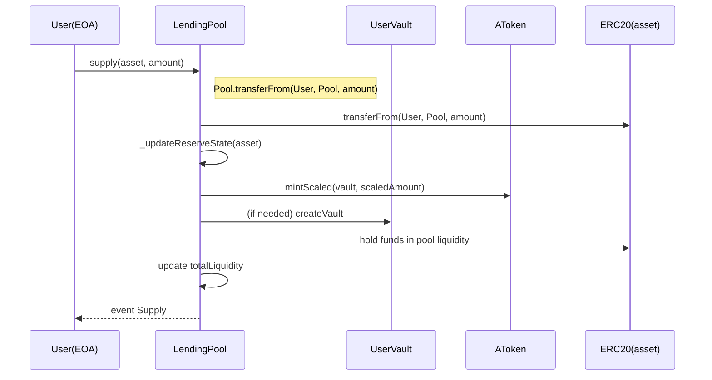
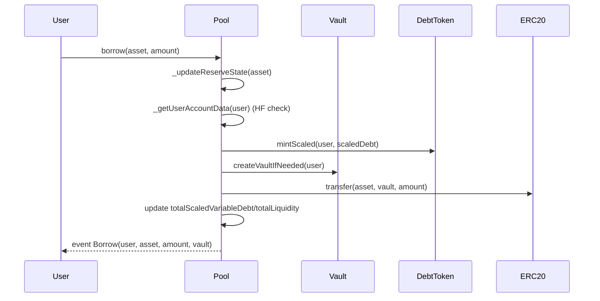
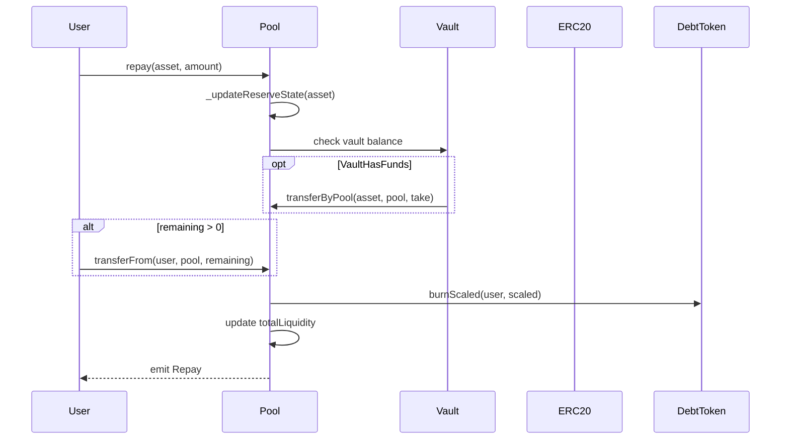
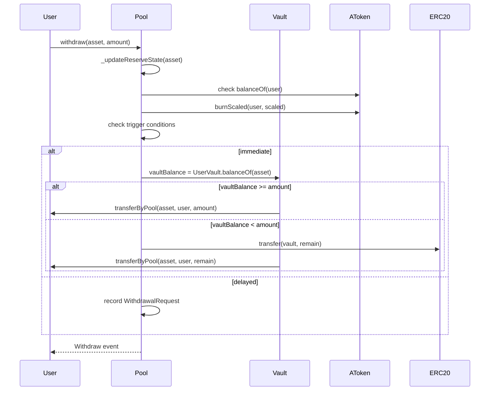
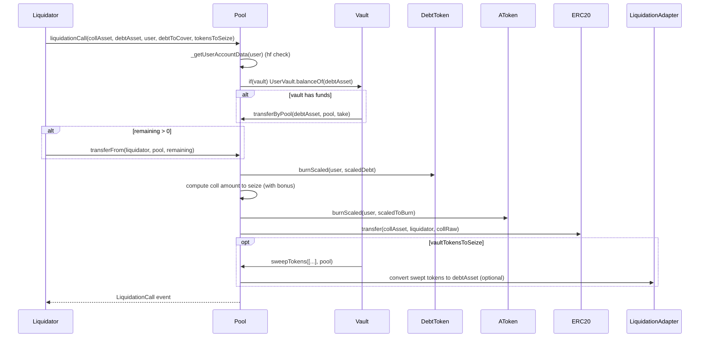

# LendingPool — 完整设计文档


---

# 目录

1. [概览](#概览)
2. [总体架构与关键设计决策](#总体架构与关键设计决策)
3. [合约清单与职责说明](#合约清单与职责说明)
4. [关键数据结构说明（ReserveData、WithdrawalRequest、UserVault）](#关键数据结构说明)
5. [主要流程（supply / borrow / repay / withdraw / liquidation）与时序图](#主要流程与时序图)
6. [合约API参考](#合约API参考)
7. [利率算法和流程](#利率算法和流程)
8. [事件与日志](#事件与日志)
9. [附录：单位/定点数约定（WAD / RAY / 18-dec）](#附录-单位定点数约定)

---

## 概览

本项目实现了一个 Aave-like 的借贷协议原型，并在其基础上引入了**用户托管合约（UserVault）**，满足如下目标：

* **超额借贷支持**：允许在风控约束下实现高杠杆（例如上限 10x），但通过托管合约与额外约束防止资金被直接套现；
* **借款资金托管**：所有借贷出的底层资产统一转入 `UserVault`，不会直接发送到用户 EOA；
* **Vault 内受限操作**：用户可通过 `UserVault.executeAdapter` 调用受信任的 adapter（或白名单合约）与 DEX 交互，但不能直接将 Vault 资金转走到任意外部地址；
* **还款 / 清算优先从 Vault 操作**：`repay` 与 `liquidation` 会首先尝试使用 Vault 中的余额来偿还/覆盖，若不足再从外部地址补足；
* **清算资产可回收**：支持把 Vault 中的 token sweep 回 Pool 并通过 liquidation adapter 变现以补偿债务。

---

## 总体架构与关键设计决策

### 架构图（概念）

```
+-----------------+        +-----------------+        +----------------+
|     User EOA    | <----> |    LendingPool  | <----> |    Reserves    |
| (owner of vault)|        |  (core logic)   |        | (ERC20 assets) |
+-----------------+        +-----------------+        +----------------+
          |                         ^  ^
          |                         |  |
          v                         |  +--> InterestRateStrategy
+-----------------+                 |
|    UserVault    | <---------------+
| (per-user proxy) |
+-----------------+
          |
          v
    Allowed adapters (DEX/router)
```

### 关键决策（简述）

* **Vault-first 资金流**：借出的资产**必须先到 Vault**，用户不能直接拿到借出的资产，Vault 里的流动性只能通过受控 adapter 交互，或由 Pool 在审核下释放。这样能阻止用户直接套现，同时仍允许 Vault 在受控范围内进行 on-chain 交易。
* **Adapter 模式**：Vault 只调用审计过的 adapter（或 pool 管理的白名单合约），并强制 adapter 把 swap/交易输出留在 Vault 或 Pool，防止 adapter 向任意 recipient 发钱。
* **Debt 仍计到用户 EOA**：VariableDebtToken 的债务持有人为 user（EOA），因此清算逻辑按用户身份触发，但资金回收优先来自对应的 Vault。
* **清算优先级**：先从 Vault 扣取债务资产 / sweep token；不足时再 burn aToken（collateral）并支付给 liquidator。

---

## 合约清单与职责说明

* `LendingPool`（核心）

    * 管理 reserves、利率、用户借贷生命周期；与 UserVault 协同执行 borrow/repay/withdraw/ liquidation。
    * 维护 `allowedTargets`（adapter 白名单）、`userVaults` 映射。

* `AToken`（抵押凭证）

    * 执行 scaled accounting（scaled balances + liquidityIndex），代表用户抵押份额；但在本实现中 aToken 可被转移（转移会转移抵押权利），在生产中需注意业务规则。

* `VariableDebtToken`

    * 记录用户可变利率债务（scaled accounting），禁用 transfer/approve，防止债务转移。

* `InterestRateStrategy`（利率模型）

    * 根据利用率与保留因子计算 liquidity rate / variable borrow rate。

* `UserVault`（每用户单独合约）

    * 存放借出资产与用户通过借款买入的资产；提供 `executeAdapter`（或 `execute`）以调用白名单 adapter；Pool 可调用 `transferByPool` / `sweepTokens` 扣押资产以便清算或补偿。

* `IAggregatorV3`（Chainlink-like price oracle）

    * 提供资产价格（需在部署时配置），用于借款校验、清算计算等。

---

## 关键数据结构说明

### `ReserveData`（简要字段回顾）

字段与单位（重要）

* `asset` (address)： ERC20 地址
* `aToken` (address)： aToken 合约地址
* `variableDebtToken` (address)：债务 token
* `decimals` (uint8)：资产原始 decimals
* `liquidityIndex` (uint256, RAY)：流动性索引（RAY=1e27），scaled -> real
* `variableBorrowIndex` (uint256, RAY)：债务索引
* `currentLiquidityRate` (RAY)
* `currentVariableBorrowRate` (RAY)
* `lastUpdateTimestamp` (uint256)
* `totalScaledVariableDebt` (scaled units)
* `totalLiquidity` (18-dec units, WAD-based internal)
* `ltv` (RAY)：loan-to-value
* `liquidationThreshold` (RAY)
* `liquidationBonus` (RAY)
* `reserveFactor` (RAY)
* `interestStrategy` (address)
* `priceOracle` (IAggregatorV3)
* `minLiquidityRatio` (WAD)

> **备注**：务必在阅读代码时保持单位意识（RAY / WAD / 18-dec / raw token decimals），错用单位会导致严重计算错误。

### `WithdrawalRequest`（保留提现延迟逻辑）

* `amount18`：WAD 单位记录请求金额
* `unlockTimestamp`：可领取时间戳
* `exists`：是否存在请求

### `UserVault` 状态

* `owner`：vault 的所有者（user EOA）
* `pool`：pool 地址（只有 pool 可调用 seize/pull）
* Vault 中的 token 由标准 ERC20 `balanceOf(vault)` 表示

---

## 主要流程与时序图


### 1) Supply（用户抵押）



### 2) Borrow（借款 -> 资金到 Vault）



### 3) Repay（优先从 Vault）



### 4) Withdraw（提现只能从 Vault 发放）



### 5) Liquidation（清算优先从 Vault）



---

## 合约API参考

> 下面逐 contract 列出关键方法、输入输出、行为与注意点。为了可读性，省略了私有/内部只在文件中用到的 helper（详见源码）。

### LendingPool（核心）

* `initReserve(address asset, uint8 decimals, address priceOracle, address interestStrategy, uint256 ltv, uint256 liquidationThreshold, uint256 liquidationBonus, uint256 reserveFactor)`

    * 作用：初始化一个储备；部署 aToken 与 VariableDebtToken；设置初始 index。
    * 注意：owner-only；`ltv` / `liquidationThreshold` / `liquidationBonus` / `reserveFactor` 单位均为 RAY（1e27）。

* `supply(address asset, uint256 amountRaw)`

    * 作用：用户抵押资产到 pool；pool 扣取用户 token 并给 userVault（或 user）mint aToken（此实现 mint 给 user）。
    * 注意：你可调整为 mint 给 `userVault` 以更强保证抵押不可转出。

* `borrow(address asset, uint256 amountRaw)`

    * 作用：用户借款；先检查 health factor；mint debt 给 user；并把借款资产转入用户 Vault。
    * 注意：借款的实际 token 转账是 `IERC20(asset).transfer(vault, amountRaw)`。

* `repay(address asset, uint256 amountRaw)`

    * 作用：优先从 `userVault` 拉取还款，若不足则从 `msg.sender` 拉取。
    * 注意：使用 before/after balance 差值能提高对 fee-on-transfer 的兼容性。

* `withdraw(address asset, uint256 amountRaw)` 与 `claimWithdrawal`

    * 作用：用户提取存款。必须从 Vault 提取（本实现会创建 Vault 并从 Vault 发放）。
    * 注意：提现逻辑需保证 atomicity；若触发延时，记录请求。

* `liquidationCall(address collateralAsset, address debtAsset, address user, uint256 debtToCoverRaw, address[] calldata vaultTokensToSeize)`

    * 作用：清算函数；首先尝试使用 Vault 中的债务资产还款，若不足则使用清算者提供的资产；随后按 `liquidationBonus` 计算需没收的 collateral quantity 并发给清算者；最后可 `sweepTokens` 把 vault 里的指定 token 转回 pool。
    * 注意：现实中需把 `sweepTokens` 里拿回的资产通过 `liquidationAdapter` 变现以补偿池子或回收损失。

* `setAllowedTarget(address target, bool allowed)`

    * 作用：由 owner 管理 Vault 可调用的 adapter/目标合约白名单（强烈建议只允许 protocol-provided adapter）。

* `_createVaultIfNeeded(address user)`

    * 内部方法：当用户第一次借款或发生需要 Vault 的操作时创建 `UserVault`。
    * 注意：创建 Vault 的成本高，建议使用 EIP-1167 minimal proxy 优化（Clones）。

### UserVault（托管）

* `constructor(address _owner, address _pool)`

    * 初始化 vault（owner/user 与 pool 链接）。

* `execute(address target, bytes calldata data)`

    * 作用：owner（user）发起对 `target` 的低级调用。但**必须**先通过 pool 的 `isAllowedTarget(target)` 才能调用。
    * **安全性**：**千万不要**把 `target` 设为任意 Router，除非你在 adapter 内强制 recipient = vault，自行审计并保证不能把资金送到 arbitrary recipient。

* `transferByPool(address token, address to, uint256 amount)`

    * 作用：只有 pool 可以调用，用于清算或 protocol 操作时把 vault 内资金转出。

* `sweepTokens(address[] calldata tokens, address to)`

    * 作用：pool 可以一次性把 vault 中一组 token 转到 `to`（通常 to=pool，用于后续变现）。

---

## 利率算法和流程

在此 LendingPool 合约中，采用基于 `InterestRateStrategy` 合约的可变利率机制。利率的计算涉及两个主要部分：抵押利率和债务利率。

### 抵押利率计算
抵押利率是指存入资金（资产）的回报率。它主要与池中的总流动性（即池中的资产总额）以及借款池中资产的需求有关。根据池中资产的借贷需求情况，利率会动态变化。具体计算公式如下：

1. 总借款和总流动性：
   - ` utilization = totalBorrows / (availableLiquidity + totalBorrows)` 计算借贷利用率。
2. 基础利率（base rate）：
- 当利用率较低时，抵押利率将比较低。
- 利率计算如下：
  - `variableBorrowRate = baseVariableBorrowRate + (utilization / optimalUtilizationRate) * slope1`
- 当利用率较高时，利率将开始增加，超过一定利用率后进入坡度2阶段：
  - `variableBorrowRate = baseVariableBorrowRate + slope1 + ((utilization - optimalUtilizationRate) / (1 - optimalUtilizationRate)) * slope2`
3. 抵押利率（liquidityRate）：
- 计算流动性回报：
  - `liquidityRate = rayMul(rayMul(variableBorrowRate, utilization), oneMinusReserve)`
- 这里的 `oneMinusReserve` 是为了考虑部分资金池资金用于担保等其他用途。该部分被称为“储备金（reserveFactor）”。

### 债务利率计算
债务利率是借款人借用资金时需要支付的利率。这个利率基于池中的借款总额和池中可用流动性的变化而变化。与抵押利率相似，债务利率也会随着借款池的需求和可用流动性的变化而变化。
1. 借款利率计算：
- 借款利率与 variableBorrowIndex 和 availableLiquidity、totalBorrows 的利用率挂钩，借款的成本随着池子流动性紧张而增高。
2. 变量借款率（variableBorrowRate）：
- 在 `InterestRateStrategy` 合约中，债务利率的计算基于相同的 `utilization`（借款使用率）值。
- 当借款需求增加时，借款利率将上升。
- 计算方式与上述的 **抵押利率** 类似，利用 `optimalUtilizationRate`、`slope1` 和 `slope2` 来调整借款利率。

---

## 事件与日志

* `ReserveInitialized(asset, aToken, variableDebtToken)`
* `Supply(user, asset, amountRaw)`
* `Borrow(user, asset, amountRaw, vault)`
* `Repay(payer, asset, amountRaw)`
* `LiquidationCall(collateralAsset, debtAsset, user, liquidator, debtRepaidRaw, collateralSeizedRaw)`
* `Withdraw(user, asset, amountRaw, delayed, unlockTimestamp)`
* `ClaimWithdrawal(user, asset, amountRaw)`
* `VaultCreated(user, vault)`
* `AllowedTargetSet(target, allowed)`
* `UserVault.Executed(adapter, data, result)` (在 Vault 合约内)
* `UserVault.TransferredByPool(token, to, amount)`

---


## 附录-单位定点数约定

* **WAD = 1e18**：用于以 18-dec 为基准的金额（USD 估值、内部 18-dec 归一化）。
* **RAY = 1e27**：用于索引与利率（更高精度）。
* **raw token decimals**：ERC20 的原始 decimals（例如 USDC=6）；使用 `PoolUtils.to18()` / `from18()` 在 raw <-> 18-dec 间转换。

---

